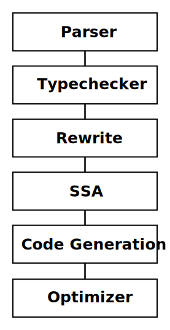

=============================
Blaze Compiler Infrastructure
=============================

.. highlight:: c

Blir is the Blaze intermediate representation. It aims to be a simple
statically typed C/Python like language that can be programmatically
generated from Python itself to generate kernels and executed over Blaze
and NumPy structures without going through Python AST as intermediate
pass.

The goal is not general purpose programming but to generate a a simple
compiler target that is human readable and amenable to array computing
and kernel generation while still being flexible. Blir is more or less
inspired by the `C-- intermediate language`_.

.. _C-- intermediate language: http://www.cminusminus.org/

Right now BLIR is fairly naive, it does not do a lot of common
optimizations ( strength reduction, loop invariant code motion, common
subexpression elimination ). The goal is simply to create a programmatic
interface for generating kernels and (maybe) make it efficient.

Goals
-----

- A *small* portable language with C like syntax
- Ability to dynamically generate much of what exists in the NumPy
  ``umath.h`` library on demand specialized to any Blaze data type.
- An interface between high-level expressions and retargetable optimizing code generators
- Phasing out NumPy memory blocks in favor of
  supporting computation over BLZ and out-of-core data described
  over the Blaze protocol.

Example Syntax
--------------

Some examples of trivial compute kernels:

::

    def kernel(x : array[int]) -> int {
        var int i;
        var int j;

        for i in range(5) {
            for j in range(5) {
                x[i,j] = i*j+1;
            }
        }
        return 0;
    }

::

    def add(x : int, y : int) -> int {
        return x+y;
    }

::

    def sumrange(x : int, y : int) -> int {
        var int i;
        var int accum;

        for i in range(x, y) {
            accum = accum + i;
        }
        return accum;
    }

::

    def sdot(x: array[float], y: array[float], n : int) -> float {
        var float accum = 0.0;
        var int i = 0;

        for i in range(n) {
            accum = accum + x[i]*y[i];
        }
        return accum;
    }

Library Usage
-------------

The toplevel of BLIR compiler exposes two commands.

:compile:
    Compile the given source string with the passed options and returns a tuple (``ast``, ``env``)

..

:execute:
    Executes a named function given a passed ``env`` context.

The two objects exposed from the compiler library are the ``ast``
and ``env``.

:ast:
    The parse tree for the given source.

..

:env:
    The compiler environment passed through and accumulates state
    from the compiler passes ultimatly resulting in a LLVM
    module.

Example usage:

.. code-block:: python

    import time
    import numpy as np
    from blaze.blir import compile, execute

    source = """
    def main(x: array[int], n : int) -> void {
        var int i;
        var int j;
        for i in range(n) {
            for j in range(n) {
                x[i,j] = i+j;
            }
        }
    }
    """

    N = 15
    ast, env = compile(source)

    arr = np.eye(N, dtype='int32')
    args = (arr, N)

    execute(env, args, timing=True)
    print arr

Prelude
-------

The prelude is existing body of C libraries that are linked into the
generated code automatically. These will include string manipulation,
file handling and Blaze iterator protocol.

External Libraries
------------------

Blaze compute kernels can include external C libraries which are
specified with ``foreign`` keyword.

::

    foreign "C" def append(x : str, y: str) -> str;

Pipeline
--------

Opcodes
-------

Internally after CFG generation Blaze uses a set of internal opcodes to
stand for units of code generation that are then translated into LLVM
constructs. These are more or less modeled after the Python bytecode,
but with different semantics.

* ALLOC
* ARRAYLOAD
* ARRAYSTORE
* BINARY_ADD
* BINARY_DIVIDE
* BINARY_MULTIPLY
* BINARY_SUBTRACT
* CALL_FOREIGN
* CALL_FUNCTION
* COMPARE
* GLOBAL
* LOAD
* LOAD_ARGUMENT
* LOAD_CONST
* PRINT
* RETURN
* STORE
* UNARY_NEGATIVE
* UNARY_NOT
* UNARY_POSITIVE

Numpy Compat
------------

NumPy arrays are passed by deconstructed into packed structures
of pointers and represented as alias typess in LLVM modules.

For example a 3x2 array of integers would be passed into LLVM by
converting it into a C structure with the data pointer and
strides array.

.. code-block:: python

    arr = np.array([[1,2,3], [1,2,3]], dtype='int32')

.. code-block:: c

    struct ndarray {
        char *data;
        int dims;
        int *strides;
    }

The following BLIR code would utilize the above structure passed
into it as an argument.

.. code-block:: c

    def main(x : array[int]) -> void {
    }

And would emit the following LLVM:

.. code-block:: llvm

    ; ModuleID = 'blirkernel'

    %ndarray_i32 = type { i32*, i32, i32* }

    define i32 @main(%ndarray_i32*) {
    entry:
      %x_data = getelementptr %ndarray_i32* %0, i32 0, i32 0
      %x_dims = getelementptr %ndarray_i32* %0, i32 0, i32 1
      %x_strides = getelementptr %ndarray_i32* %0, i32 0, i32 2
      ret void
    }

Standlone Compiler
------------------

For debugging there is a standalone compiler that takes Blir source as
input. Flags can be passed to debug compiler internals and emit either
LLVM or x86 as well as executing some simple programs.

::

    usage: blirc [-h] [--ddump-parse] [--ddump-lex] [--ddump-blocks] [--ddump-tc]
                 [--ddump-optimizer] [--noprelude] [--nooptimize] [--emit-llvm]
                 [--emit-x86] [--run]
                 [file]

    positional arguments:
      file               Source file

    optional arguments:
      -h, --help         show this help message and exit
      --ddump-parse      Dump parse tree
      --ddump-lex        Dump token stream
      --ddump-blocks     Dump the block structure
      --ddump-tc         Dump the type checker state
      --ddump-optimizer  Dump diff of the LLVM optimizer pass
      --noprelude        Don't link against the prelude
      --nooptimize       Don't run LLVM optimization pass
      --emit-llvm        Generate output files in LLVM formats
      --emit-x86         Generate output files in x86 assembly
      --run              Execute generated code

Directory Structure
-------------------

For developers the BLIR directory hierarchy is described below:

::

    blaze/blir
    ├── astutils.py    # Miscellenous AST debug utilities
    ├── blex.py        # Compiled lexer table
    ├── blocks.py      # Block structure (basic, ifelse, while, for)
    ├── btypes.py      # Type system  
    ├── byacc.py       # Compiled parser table
    ├── cfg.py         # Control flow generator
    ├── codegen.py     # LLVM code generation
    ├── datashape.c    # Datashape logic
    ├── datashape.h    # Datashape headers
    ├── errors.py      # Error reporting
    ├── exc.py         # Execution
    ├── lexer.py       # Lexer logic
    ├── magic.py       # IPython magic
    ├── opcodes.py     # Opcode definitions
    ├── parser.py      # Parser logic
    ├── passes.py      # Compiler logic ( MAIN ENTRY POINT )
    ├── prelude.c      # C libraries for Prelude
    ├── syntax.py      # AST node definitions
    ├── typecheck.py   # Type checker and annotator
    └── viz.py         # CFG visualization with graphviz

