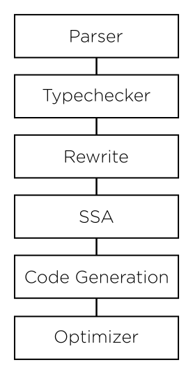

=============================
Blaze Compiler Infrastructure
=============================

Blir is the Blaze intermediate representation. It aims to be a simple
statically typed C/Python like language that can be programmatically
generated from Python itself to generate kernels and executed over Blaze
and NumPy structures without going through Python AST as intermediate
pass.

The goal is not general purpose programming but to generate a a simple
compiler target that is human readable and amenable to array computing
and kernel generation while still being flexible. Blir is more or less
inspired by the `C-- intermediate language`_.

.. _C-- intermediate language: http://www.cminusminus.org/

Right now BLIR is fairly naive, it does not do a lot of common
optimizations ( strength reduction, loop invariant code motion, common
subexpression elimination ). The goal is simply to create a programmatic
interface for generating kernels and (maybe) make it efficient.

Goals
-----

- A *small* portable language with C like syntax
- Ability to dynamically generate much of what exists in the NumPy
  ``umath.h`` library on demand specialized to any Blaze data type.
- An interface between high-level expressions and retargetable optimizing code generators
- Phasing out NumPy memory blocks in favor of
  supporting computation over BLZ and out-of-core data described
  over the Blaze protocol.

Example Syntax
--------------

Some examples of trivial compute kernels:

::

    def mykernel(x : array[int]) -> int {
        var int i;
        var int j;

        for i in range(5) {
            for j in range(5) {
                x[i,j] = x[i,i] + x[j,j];
            }
        }
        return 0;
    }

::

    def add(x : int, y : int) -> int {
        return x+y;
    }

::

    def sumrange(x : int, y : int) -> int {
        var int i;
        var int accum;

        for i in range(x, y) {
            accum = accum + i;
        }
        return accum;
    }

::

    def alltrue(x: array[bool]) -> bool {
        var bool cond;

        for i in range(1000) {
            cond = cond && x[i];
        }
        return cond;
    }

Prelude
-------

The prelude is existing body of C libraries that are linked into the
generated code automatically. These will include string manipulation,
file handling and Blaze iterator protocol.

External Libraries
------------------

Blaze compute kernels can include external C libraries which are
specified with ``foreign`` keyword.

::

    foreign "C" def append(x : str, y: str) -> str;

Pipeline
--------

Opcodes
-------

Internally after CFG generation Blaze uses a set of internal opcodes to
stand for units of code generation that are then translated into LLVM
constructs. These are more or less modeled after the Python bytecode,
but with different semantics.

* ALLOC
* ARRAYLOAD
* ARRAYSTORE
* BINARY_ADD
* BINARY_DIVIDE
* BINARY_MULTIPLY
* BINARY_SUBTRACT
* CALL_FOREIGN
* CALL_FUNCTION
* COMPARE
* GLOBAL
* LOAD
* LOAD_ARGUMENT
* LOAD_CONST
* PRINT
* RETURN
* STORE
* UNARY_NEGATIVE
* UNARY_NOT
* UNARY_POSITIVE
