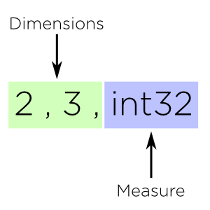

Datashape
=========

.. highlight:: ocaml

Datashape is a generalization of ``dtype`` and ``shape`` into a micro
type system which lets us overlay high level structure on existing
data in Table and Array objects that can inform better code
generation and scheduling.

Overview
~~~~~~~~

Just like in traditional NumPy, the preferred method of implementing
generic vector operators is through ad-hoc polymorphism. Numpy's style
of ad-hoc polymorphism allows ufunc objects to have different behaviors
when "viewed" at different types. The runtime system then chooses an
appropriate implementation for each application of the function, based
on the types of the arguments. Blaze simply extends this specialization
to data structure and data layout as well as data type ( dtype ).

In fact many of the ideas behind datashape are generalizations and
combinations of notions found in Numpy:

.. cssclass:: table-bordered

+----------------+----------------+
| Numpy          | Blaze          |
+================+================+
| Broadcasting   | Unification    |
+----------------+----------------+
| Shape          |                |
+----------------+ Datashape      |
| Dtype          |                |
+----------------+----------------+
| Ufunc          | Gufunc         |
+----------------+----------------+

Datashapes in Blaze do not form a hierarchy or permit subtyping. This
differs from type systems found in other languages like OCaml and Julia
which achieve a measure of type polymorphism through the construction of
hierarchies of types with an explicit pre-ordering.

Blaze favors the other approach in that types do not exist in a
hierarchy but instead are inferred through constraint generation at
"compile time". In addition it also permits a weakened version of
gradual typing through a dynamic type ( denoted ``?`` ) which allows a
"escape hatch" in the type system for expressing types of values which
cannot be known until runtime.

The goal of next generation of vector operations over Blaze structures
aim to allow a richer and more declarative way of phrasing operations
over semi-structured data. While types are a necessary part of writing
efficient code, the ideal type system is one which disappears entirely!

Units
-----

Datashape types that are single values are called **unit** types. They
represent a fixed type that has no internal structure. For example
``int32``.

In Blaze there are two classes of units: **measures** and
**dimensions**. Measures are units of data, while dimensions are
units of shape. The combination of measure and dimension in datashape
constructors uniquely describe the space of possible values or
**dataspace** of a table or array object.

Dataspace mappings which preserve values ( i.e. homomorphisms ) are
called **index-space transformations**.

Bit Types
~~~~~~~~~

The native bit types or **CType** objects are unit types standing for
unboxed machine types. These inherit the notation from NumPy.

.. cssclass:: table-striped

==========  =========================================================
Bit type    Description
==========  =========================================================
bool        Boolean (True or False) stored as a byte
int         Platform integer (normally either ``int32`` or ``int64``)
int8        Byte (-128 to 127)
int16       Integer (-32768 to 32767)
int32       Integer (-2147483648 to 2147483647)
int64       Integer (9223372036854775808 to 9223372036854775807)
uint8       Unsigned integer (0 to 255)
uint16      Unsigned integer (0 to 65535)
uint32      Unsigned integer (0 to 4294967295)
uint64      Unsigned integer (0 to 18446744073709551615)
float       Shorthand for ``float64``.
float16     Half precision float: sign bit, 5 bits exponent,
            10 bits mantissa
float32     Single precision float: sign bit, 8 bits exponent,
            23 bits mantissa
float64     Double precision float: sign bit, 11 bits exponent,
            52 bits mantissa
complex     Shorthand for ``complex128``.
complex64   Complex number, represented by two 32-bit floats (real
            and imaginary components)
complex128  Complex number, represented by two 64-bit floats (real
            and imaginary components)
==========  =========================================================

Blaze also adds a variety of bit-like types which are implemented
a subset of specialized storage and computation backends.

.. cssclass:: table-striped

==========  =========================================================
Bit type    Description
==========  =========================================================
double      Fixed point precision
varchar     Variable length string
blob        Binary large object
==========  =========================================================

Several python types are can be mapped directly on to datashape types:

.. cssclass:: table-striped

===========  =========================================================
Python type  Datashape
===========  =========================================================
int          int
bool         bool
float        float
complex      cfloat
str          string
unicode      unicode
buffer       void
===========  =========================================================

Endianness
~~~~~~~~~~

TODO

Products
--------

A comma between two types signifies a product type. Product types
correspond to branching possibilities of types.

The product operator ``(,)`` is used to construct product types.
It is a type constructor of two arguments with a special infix
sugar.

Example::

    a, b

It is also left associative, namely::

    ((a, b), c) = a, b, c

The outer element a product type is referred to as a **measure**
while the other elements of the product are referred to as
**dimensions**.

The product operator has the additional constraint that the first
operator cannot be a measure. This permits types of the form::

    1, int32
    1, 1, int32

But forbids types of the form::

    int32, 1
    int32, int32

There is a algebraic relation between product types and sum types
( discussed below ).

Fixed
~~~~~

The unit shape type is a dimension unit type. They are represented
as just integer values at the top level of the datatype. These are
identical to ``shape`` parameters in NumPy. For example::

    2, int32

The previous signature Is an equivalent to the shape and dtype of a
NumPy array of the form::

    ndarray(dtype('int32'), shape=(1,2))

A 2 by 3 matrix of integers has datashape::

    2, 3, int32

With the corresponding NumPy array::

    ndarray(dtype('int32'), shape=(2,3))

Constructors
~~~~~~~~~~~~

A type constructor is a parameterized type definition for specifying
polymorphic types. Polymorphic types specify containers that are capable
of holding values of many different types conforming to the intermix of
the constructors.

The **kind** of a argument specifies the signature of the constructor in
relation to its parameters.

::

    K = * | K -> K

For example type constructor with no parameters has the base
kind ``(*)``, a type constructor with two parameters has kind ``(*
-> *)``.

By supplying a type constructor with one or more **concrete types**, new
**type instances** can be constructed and added to the system. Datashape
types that are comprised of multiple unit types are called **composite**
types. The product operator discussed above yields composite types.
Example::

    2, int32

Datashape types with free parameters in their constructor are called
**parameterized** types. Example::

    SquareMatrix T = N, N, T

Datashape types without free parameters in their constructor are called
**alias** types. Alias types don't add any additional structure they just
ascribe a new name. Example::

    AliasType N = N, N, int32

Datashape types can be **anonymous** or labeled. Once a type is
registered it can be used in dshape expressions just like primitive
values and to construct even higher order types.

Blaze does not permit recursive type definitions.

Datashape types are split into three equivalence classes.

:Fixed:

    Fixed types are equal iff their value is equal::

        1 == 1
        1 != 2

:CTypes:

    Bit types are equal iff their data type name and width
    are equal::

        int32 == int32
        int64 != int32
        int8 != char

:Composite:

    Composite datashape types are **nominative**, in that the equivalence of
    two types is determined whether the names they are given are equivalent.
    Thus two datashapes that are defined identically are still not equal to
    each other::

        A = 2, int32
        B = 2, int32

        A == A
        A != B

While it is true that structurally equivalent composites are not equal
to each other, it is however necessarily true that the unification of
two identically defined composite types is structurally identical to the
two types.

Records
~~~~~~~

Record types are ordered struct-like objects which hold a collection of
types keyed by labels. Records are also an in the class of **measure**
types. Records are sugard to look like Python dictionaries but
are themselves type constructors of variable number of type arguments.

Example 1::

    Person = {
        name   : string;
        age    : int;
        height : int;
        weight : int
    }

Example 2::

    RGBA = {
        r: int32;
        g: int32;
        b: int32;
        a: int8
    }

Records are themselves types declaration so they can be nested,
but cannot be self-referential:

Example 2::

    type Point = {
        x : int;
        y : int
    }

    type Space = {
        a: Point;
        b: Point
    }

Or equivelantly::

    type Space = {
        a: { x: int; y: int };
        b: { x: int; y: int }
    }

Composite datashapes that terminate in record types are called
**table-like**, while any other terminating type is called
**array-like**.

Example of array-like::

    ArrayLike = 2, 3, int32

Example of table-like::

    TableLike = { x : int; y : float }

Enumeration
-----------

A enumeration specifies a number of fixed dimensions sequentially. Example::

    {1,2,4,2,1}, int32

The above could describe a Python structure of the form::

    [
        [1],
        [1,2],
        [1,3,2,9],
        [3,2],
        [3]
    ]

..
    (1 + 2 + 4 + 2 + 1) * int32

Type Variables
~~~~~~~~~~~~~~

**Type variables** a seperate class of types expressed as free variables
scoped within the type signature. Holding type variables as first order
terms in the signatures encodes the fact that a term can be used in many
concrete contexts with different concrete types.

Type variables that occur once in a type signature are referred to as
**free**, while type variables that appear multiple types are **rigid**.

For example the type capable of expressing all square two dimensional
matrices could be written as a combination of rigid type vars::

    A, A, int32

A type capable of rectangular variable length arrays of integers
can be written as two free type vars::

    A, B, int32

Type variables are reduced through scope of constructors and unified
into one of two classes:

* **dimension-generic**
* **measure-generic**

::

    DimGen T = T, int
    TypGen T = 2, T

For example in the following signature the type variable T is unified in
both arguments to the type constructor ``Either``::

    Sig T = Either( (2, 2, T), (3, 3, T) )

A type signature may only be either dimension-generic or
measure-generic. Attempting to use a type variable in both will raise an
exception ``AmbigiousTypeVariable``. For example::

    Sig T = Either( (2, 2, T), (T, 2, int) )

Not all declarations of type variables are well-defined. For example
it is not possible to expression a Range type in terms of variable. An
instance like this would require a immensely more sophisticated type
system.

::
    
    InvalidSig1 T = Range(0, T)

..
    (1x + 2x + ... + Ax) * (1y + 2y + ... By)

Sums
----

A **sum type** is a type representing a collection of heterogeneously
typed values. There are four instances of sum types in Blaze's type
system:

* :ref:`variant`
* :ref:`union`
* :ref:`option`
* :ref:`range`

.. _variant:

Variant
~~~~~~~

A **variant** type is a sum type with two tagged parameters ``left`` and
``right`` which represent two possible types. We use the keyword
``Either`` to represent the type operator. Examples::

    Either(float,char)
    Either(int32,float)
    Either({x: int}, {y: float})

..
    1 + B + C ...

.. _union:

Union
~~~~~

A **union** or **untagged union** is a variant type permitting a
variable number of variants. Unions behave like unions in C and permit a
variable number of heterogeneous typed values::

    Union(int8,string)

::

    Union(int8,int16,int32,int64)

..
    A + B + C ...

.. _option:

Option
~~~~~~

A Option is a tagged union representing with the left projection being
the presence of a value while the right projection being the absence of
a values. For example in C, all types can be nulled by using ``NULL``
reference.

For example a optional int field::

    Option(int32)

Indicates the presense or absense of a integer. For example a (``5,
Option int32``) array could be model the Python data structure:

::

    [1, 2, 3, na, na, 4]

Option types are only defined for type arguments of unit measures and
Records.

..
    1 + A

.. _range:

Range
~~~~~

Ranges are sum types over intervals of Fixed dimensions types.

Ranges are heterogeneously fixed dimensions within a lower and upper
bound.

Example 1::

    Range(1,5)

A single argument to range is assumes a lower bound of 0.

The set of values of integer arrays with dimension less than or equal to
1000 x 1000 is given by the datashape::

    Range(1000), Range(1000), int32

The lower bound must be greater than 0. The upper bound must be
greater than the lower, but may also be unbounded ( i.e. ``inf`` ).

..
    (1 + 1 + 1 .. + 1)

Stream
~~~~~~

Ranges are sum types over shape instead of data.

A case where a ``Range`` has no upper bound signifies a potentially infinite
**stream** of values. Specialized kernels are needed to deal with data
of this type.

..
    (1 + 1 + ...)

Numpy Compatability
~~~~~~~~~~~~~~~~~~~

FAQ
---

* How do I convert from Blaze DataShape to NumPy shape and dtype?

* How do I convert from Blaze DataShape to CTypes?

Grammar
~~~~~~~

.. code-block:: text

    NAME   = [a-zA-Z_][a-zA-Z0-9_]*
    EQUALS = '='
    COMMA  = ','
    COLON  = ':'
    LBRACE = '{'
    RBRACE = '}'
    BIT    = 'bool' | 'int8' | 'int16' | 'int32' ...

    top : mod
        | stmt

    mod : mod mod
        | stmt

    stmt : TYPE lhs_expression EQUALS rhs_expression
         | rhs_expression

    lhs_expression : lhs_expression lhs_expression
                   | NAME

    rhs_expression : rhs_expression COMMA rhs_expression
                   | appl
                   | record
                   | BIT
                   | NAME
                   | NUMBER

    appl : NAME '(' rhs_expression ')'

    record : LBRACE record_opt RBRACE
    record_opt : record_opt SEMI record_opt
    record_opt : record_item
    record_opt : empty
    record_item : NAME COLON '(' rhs_expression ')'
    record_item : NAME COLON BIT
                : NAME COLON NAME
                : NAME COLON NUMBER
                | NAME COLON record
    empty :
