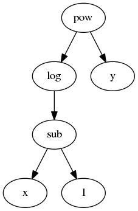

Expression Design
=================

At its core Blaze expresses analytics queries symbolicly.  It represents these
queries as an abstract expression tree.  This tree dictates user interaction,
optimizations, and is eventually walked to translate into other computational
systems.  Deep knowledge of abstact expressions is not necessary to use Blaze;
it is essential to develop in it.

Consider the following example:

.. code-block:: python

   >>> from blaze import symbol, log
   >>> x = symbol('x', 'int64')
   >>> y = symbol('y', 'float32')
   >>> z = log(x - 1)**y

We represent the mathematical expression ``log(x - 1)**y`` as a tree where
every operator (e.g. ``log``, ``pow``) is a node whose children are its
arguments.  All Blaze expressions and indeed all expressions in any
programming language can be represnted this way.  Blaze encodes this tree as a
data structure where every node is an object with type corresponding to its
operation.  For example there exists the following classes

.. code-block:: python

   class pow(Expr):
       ...
   class sub(Expr):
       ...
   class log(Expr):
       ...

And our expression, written explicitly as Blaze sees it, would look like the
following:

.. code-block:: python

   >>> from blaze.expr import Pow, Sub, log, symbol
   >>> z = Pow(log(Sub(symbol('x', 'int64'), 1)),
   ...         symbol('y', 'float32'))
   >>> z
   (log(x - 1)) ** y

Common Expression Attributes
----------------------------

There are a few important attributes and methods to investigate a Blaze
expression.

*  ``__class__``: The type of a node corresponds to its operation::

        type(z) == pow

*  ``dshape``: The shape and type of the data for this expression. This is often
   more important that the actual type of the node::

   .. code-block:: python

   >>> s = symbol('s', 'var * float64')
   >>> s.dshape
   dshape("var * float64")
   >>> s.mean().dshape
   dshape("float64")

*  ``._args``: All children of a node, including parameters.  Args may include
   both Blaze expressions and other variables like strings::

       z._args == (log(x - 1), y)
       x._args == ('x', 'int64')

*  ``._hashargs``: The arguments in a form that is hashable. This is only
   different from ``._args`` when the arguments contain things that are not
   normally hashable with the ``hash`` builtin function.

*  ``._inputs``: All children of a node, excluding parameters.  All inputs are
   Blaze expressions.::

       z._inputs == (log(x - 1), y)
       x._inputs == ()

*  ``._leaves()``:  The symbols at the bottom of the expression tree::

       z._leaves() == (x, y)
       x._leaves() == (x,)

By recursively traversing either ``._args`` or ``._inputs`` you may inspect or
transform either all information pertaining to the tree or just the
expressions.

To clear up confusion between ``._args`` from ``._inputs`` consider the
following tabular example with sort.  ``._inputs`` contains only other Blaze
expressions while ``._args`` also contains parameters like the string
``'balance'``.

.. code-block:: python

   >>> t = symbol('t', 'var * {name: string, balance: int}')
   >>> expr = t.sort('balance', ascending=True)
   >>> expr._args
   (<`t` symbol; dshape='...'>, 'balance', True)
   >>> expr._inputs
   (<`t` symbol; dshape='...'>,)

Some convenience functions for common traversals already exist:

* ``._subs``: replace nodes in the tree according to replacement dictionary::

   >>> z
   (log(x - 1)) ** y
   >>> z._subs({'x': 'a', 'y': 'b'})
   (log(a - 1)) ** b

* ``._subterms``, a traversal along ``._inputs``::

   >>> list(z._subterms())  # doctest: +NORMALIZE_WHITESPACE
   [(log(x - 1)) ** y, log(x - 1), x - 1, <`x` symbol; dshape=...>, <`y` symbol; dshape=...>]

* ``._traverse``, a traversal along ``._args``::

   >>> list(z._traverse())  # doctest: +NORMALIZE_WHITESPACE
   [(log(x - 1)) ** y,
    log(x - 1),
    x - 1,
    <`x` symbol; dshape=...>,
    'x',
    dshape("int64"),
    0,
    1,
    <`y` symbol; dshape=...>,
    'y',
    dshape("float32"),
    0]
