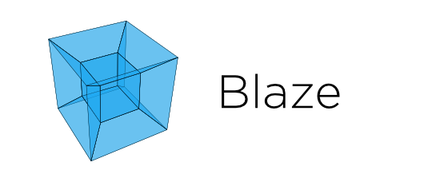

**The Blaze Ecosystem** provides Python users high-level access to efficient
computation on inconveniently large data.  Blaze can refer to both a particular
*library* as well as an *ecosystem* of related projects that have spun off of
Blaze development.

Blaze is sponsored primarily by
`Continuum Analytics <http://www.continuum.io>`_, and a
`DARPA XDATA <http://www.darpa.mil/program/XDATA>`_ grant.

Parts of the Blaze ecosystem are described below:

Ecosystem
---------

Several projects have come out of Blaze development other than the Blaze
project itself.

* The Blaze Project: Translates NumPy/Pandas-like syntax to data computing
  systems (e.g. database, in-memory, distributed-computing).  This provides
  Python users with a familiar interface to query data living in a variety of
  other data storage systems.  One Blaze query can work across data ranging
  from a CSV file to a distributed database.

  Blaze presents a pleasant and familiar interface to us regardless of what
  computational solution or database we use (e.g. Spark, Impala, SQL databases,
  No-SQL data-stores, raw-files).  It mediates our interaction with files, data
  structures, and databases, optimizing and translating our query as
  appropriate to provide a smooth and interactive session.   It allows the data
  scientists and analyst to write their queries in a unified way that does not
  have to change because the data is stored in another format or a different
  data-store.  It also provides a server-component that allows URIs to be used
  to easily serve views on data and refer to Data remotely in local scripts,
  queries, and programs.

* DataShape_: A data type system

  DataShape combines NumPy's dtype and shape and extends to missing data,
  variable length strings, ragged arrays, and more arbitrary nesting.  It
  allows for the common description of data types from databases to HDF5 files,
  to JSON blobs.

* Odo_: Migrates data between formats.

  Odo moves data between formats (CSV, JSON, databases) and locations
  (local, remote, HDFS) efficiently and robustly with a dead-simple interface
  by leveraging a sophisticated and extensible network of conversions.

* DyND_: In-memory dynamic arrays

  DyND is a dynamic ND-array library like NumPy that implements the datashape
  type system.  It supports variable length strings, ragged arrays, and GPUs.
  It is a standalone C++ codebase with Python bindings.  Generally it is more
  extensible than NumPy but also less mature.

* Dask.array_: Multi-core / on-disk NumPy arrays

  Dask.dataframe_ : Multi-core / on-disk Pandas data-frames

  Dask.arrays provide blocked algorithms on top of NumPy to handle
  larger-than-memory arrays and to leverage multiple cores.  They are a
  drop-in replacement for a commonly used subset of NumPy algorithms.

  Dask.dataframes provide blocked algorithms on top of Pandas to handle
  larger-than-memory data-frames and to leverage multiple cores.   They
  are a drop-in replacement for a subset of Pandas use-cases.

  Dask also has a general "Bag" type and a way to build "task graphs"
  using simple decorators as well as nascent distributed schedulers in
  addition to the multi-core and multi-threaded schedulers.

These projects are mutually independent.  The rest of this documentation is
just about the Blaze project itself.  See the pages linked to above for
``datashape``, ``odo``, ``dynd``, or ``dask``.

Blaze
-----

Blaze is a high-level user interface for databases and array computing systems.
It consists of the following components:

*   A symbolic expression system to describe and reason about analytic queries
*   A set of interpreters from that query system to various databases / computational engines

This architecture allows a single Blaze code to run against several
computational backends.  Blaze interacts rapidly with the user and only
communicates with the database when necessary.  Blaze is also able to analyze
and optimize queries to improve the interactive experience.

Presentations
-------------

* `See previous presentations about Blaze`_
* `See previous blog posts about Blaze`_

Index
~~~~~

User facing

.. toctree::
   :maxdepth: 1

   overview
   install
   quickstart
   queries
   split-apply-combine
   rosetta-pandas
   rosetta-sql
   uri
   csv
   sql
   ooc
   server
   datashape
   what-blaze-isnt
   api
   releases
   people
   legal

Internal

.. toctree::
   :maxdepth: 1

   expr-design
   expressions
   backends
   interactivity
   dev_workflow
   expr-compute-dev
   computation

Older Versions
~~~~~~~~~~~~~~

Older versions of these documents can be found here_.

.. _here: ../

.. _`See previous presentations about Blaze`: _static/presentations/index.html
.. _`See previous blog posts about Blaze`: http://continuum.io/blog/tags/blaze
.. _Odo: http://odo.pydata.org/
.. _DataShape: http://datashape.pydata.org/
.. _Dask.array: http://dask.pydata.org/
.. _Dask.dataframe: http://dask.pydata.org
.. _DyND: https://github.com/libdynd/libdynd
