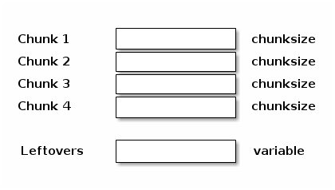

=============
Memory Layout
=============

Arrays
------

A chunked array behaves similar to a Numpy array but is composed
of multiple noncontiguous buffers in memory.

The chunks are bits of data compressed as a whole, but that can be
decompressed partially in order to improve the fetching of small parts
of the array. This chunked nature of the carray objects, together with
a buffered I/O, makes appends very cheap and fetches reasonably fast
(although the modification of values can be an expensive operation).

The compression/decompression process is carried out internally by
Blosc, a high-performance compressor that is optimized for binary data.
That ensures maximum performance for I/O operation.

.. image:: svg/memory3.png
    :align: center

Tables
------
